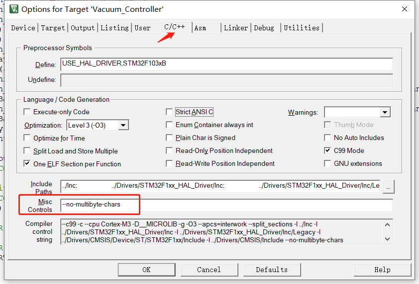

## 问题描述

本问题不是所有人都会遭遇，如果首先将 Keil5 设置为 **UTF-8** 编码后再建立工程并创建文件进行编译，可以顺利通过。但是由于 Keil5 默认使用了 **GB2312** 的编码方式，当我们项目已经开发到一半时，再借助其他软件将各个文件的编码方式进行修改，则可能会引起该报错，**具体表现** 为在输出 `log` 中显示中文乱码，而源文件或头文件中却正常显示。

当然由于我的中文主要使用重定向的 `printf()` 进行输出，所以我还额外报了如下的错误，并花费了一些时间去寻找不同编译器之间的版本差异。

```
274:improperly terminated macro invocation
```

## 解决方案

解决方法很简单，只需要在 Keil5 添加编译选项：`--no-multibyte-chars`，使编译器不处理多字节编码字符。



## 参考与致谢

- [Keil v5 MDK 编译UTF8字符串报错的解决办法](https://blog.csdn.net/zdwcmy/article/details/106368076)

> 文章作者：**TwelveCat**  
> 原文地址：<https://wiki.twelvecat.com>  
> 版权声明：文章采用 [CC BY-NC-SA 4.0](https://creativecommons.org/licenses/by-nc-sa/4.0/deed.zh) 协议，转载请注明出处。