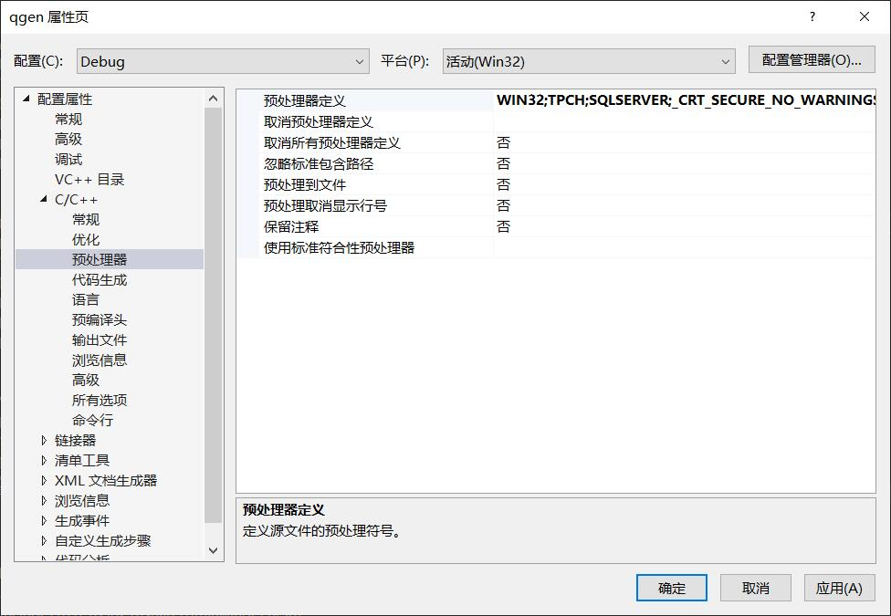
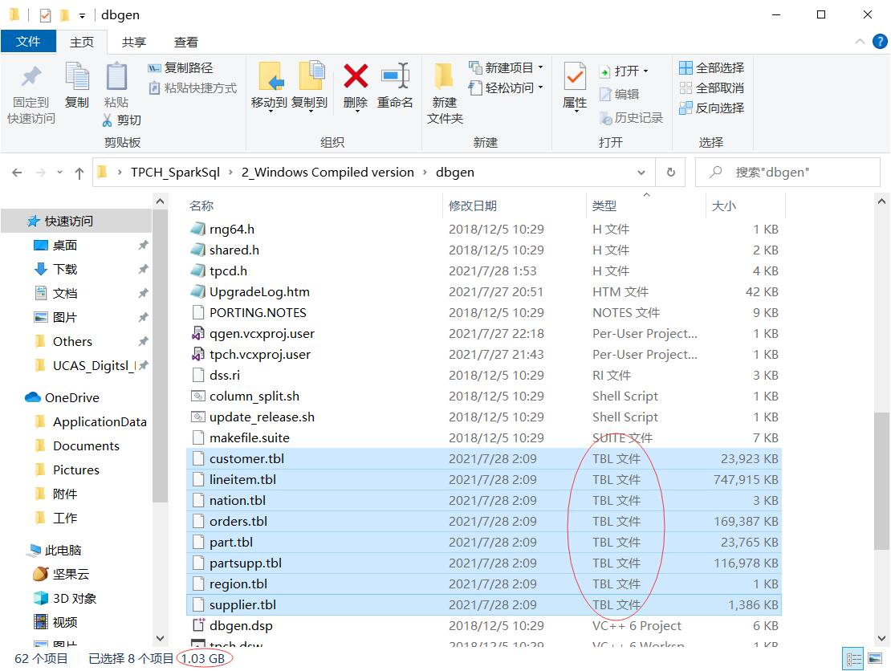
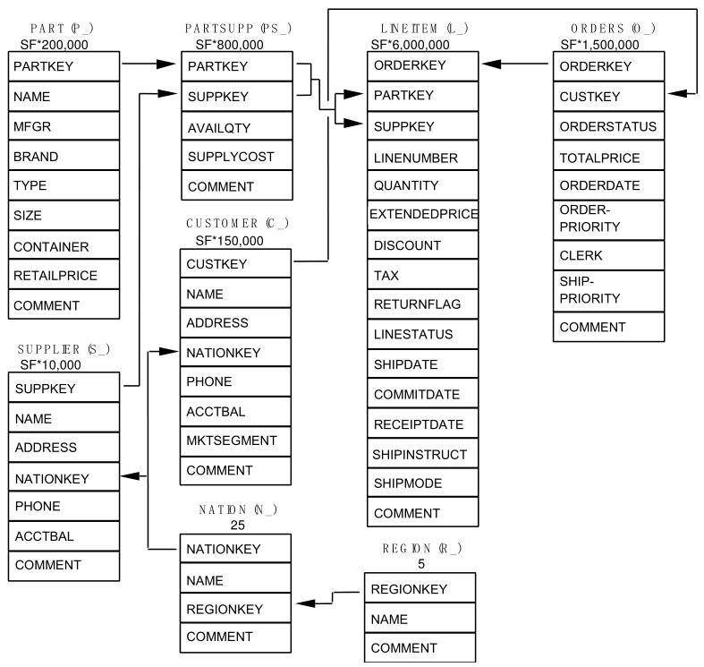

:::caution
这是一篇旧文，文章可能存在与 **[个人文档写作规范](./个人文档写作规范.md)** 相矛盾的地方。
:::


##  1 TPC-H 的简单介绍

TPC 全称为 Transaction Processing Performance Council，即「事务处理性能委员会」。而 TPC-H 是由 TPC 提供的一个决策支持基准，可以生成一些模拟的商业数据。这些数据共包含 8 个表格，而数据集的大小可以由参数指定，以此对数据库进行不同量级上的测试。为了方便使用，TPC-H 提供在 Linux 和 Windows 下生成数据，同时也可以根据实际数据库类型对配置文件进行修改，以生成符合对应数据库的测试数据。

## 2 环境配置

本项工作在以下环境下进行，测试通过。

|    类别    |          对象          |          版本          |
| :--------: | :--------------------: | :--------------------: |
|  操作系统  |        Windows         | Windows 10 专业版 20H2 |
|  操作系统  |    Linux（虚拟机）     | Ubuntu 18.04.5 Server  |
|  编译工具  |   Visual Studio 2019   |         16.8.2         |
| 虚拟机软件 | VMware Workstation Pro | 16.0.0 build-16894299  |
|  测试工具  |         TPC-H          |          3.0           |
|  软件依赖  |        Java/jdk        |       1.8.0_292        |
|  软件依赖  |         Scala          |        2.12.10         |
|  软件依赖  |         Spark          |         3.0.3          |

本项目地址 [在此](https://github.com/Twelvecat/TPC-H_SparkSQL)，共有以下文件夹：

```bash
├─0_Figure in Readme(unimportant) # 存储本md文件下的图片，无需关注
├─1_Source Code # 来自官方下载的源文件，未解压，所有工程均可以从此拷贝重新生成
├─2_Windows Compiled version # 在Windows环境下编译文件的版本，为了节省空间，已经删去tbl与csv文件，需重新生成
├─3_Linux Compiled version # 在Linux环境下编译文件的版本，为了节省空间，已经删去tbl与csv文件，需重新生成
├─4_Code Tool # 内含tbl2csv文件及Spark SQL语法参考手册
└─5_SQL Code # 内含SQL建表及删表文件，以及根据语法修改后的1、6、14号查询文件
```

## 3 源代码下载

关于 TPC-H 的介绍、源代码及手册可以在 [官方网站](http://tpc.org/) 中获取。由于官方在 2021 年 2 月更新了 TPC-H 3.0 版本，并用以下一段话简述了更新的目的，故采取了 3.0 进行实测，不过参考了大部分 Blog，3.0 与 2.x 在使用上没有太大差异。

> Over the past few years the industry has seen increases in performance and decreases in costs of computer and database systems. The TPC is introducing V3.0 of the TPC-H Benchmark to accommodate these trends and maintain the relevance of the Price/Performance metric. The primary change in this major revision is to adjust the Price/Performance metric by a multiplier of 1,000. The results shown for TPC-H V3 contain results that were converted from TPC-H V2 to the new specification.

相关的文件可以在 `./1_Source Code/` 中获取到，文件夹中的压缩文件为下载后的源文件，是未编译的初始版本。也可以通过以下网址进行下载，需要说明的是，源代码的下载需要 **工具**，不然 Google 的人机验证刷不出来。

- [TPC-H V3.0.pdf](http://tpc.org/TPC_Documents_Current_Versions/pdf/tpc-h_v3.0.0.pdf)
- [TPC-H V3.0.zip](http://tpc.org/TPC_Documents_Current_Versions/download_programs/tools-download-request5.asp?bm_type=TPC-H&bm_vers=3.0.0&mode=CURRENT-ONLY)

## 4 Windows下获取测试数据

通过解压官方的源文件可以发现，内部包含了一个名为 `./2_Windows Compiled version/dbgen/tpch.sln` 的文件，此文件可以使用 Visual Studio 打开，打开后由于 Visual Studio 版本不同会进行一个项目升级的操作，正常跟随指导升级即可。实际上升级后许多部件发生了变化，不过目前没有感觉到影响使用，具体的升迁报告可以在此处查看 `./2_Windows Compiled version./dbgen./UpgradeLog.htm`。

### 4.1 生成 dbgen.exe 与 qgen.exe

为了生成测试数据，需要先对工程进行编译，以生成一个 `.exe` 文件后再进一步操作。官方提供的 **移植方案**（`./2_Windows Compiled version/dbgen/PORTING.NOTES`） 一直在强调修改 Makefile 文件进行不同环境的移植以便编译，但是使用VS进行编译并不涉及到 Makefile 文件，相关的配置修改需要在项目设置中调整，具体的配置页面图如下图所示。Windows 编译的移植主要修改 **`SQLSERVER`** 这个参数，将其修改为我们所使用的数据库 **`SPARKSQL`**。



不过 TPC-H 并不原生支持 Spark SQL，需要在 `./2_Windows Compiled version/dbgen/tpcd.h` 中添加我们的定义，此举的目的主要是后续 `qgen.exe` 生成查询语句时能够符合对应数据的指令，从而方便测试。

```c
#ifdef 	SPARKSQL
#define GEN_QUERY_PLAN  ""
#define START_TRAN      ""
#define END_TRAN        ""
#define SET_OUTPUT      ""
#define SET_ROWCOUNT    "limit %d\n"
#define SET_DBASE       "use %s\n"
#endif
//未查找到Spark SQL有关事务处理的相关命令，故与TRAN有关的命令选择留空
```

完成了上述的修改后，在 Visual Studio 中分别选中两个项目，右键生成即可在 `./2_Windows Compiled version/dbgen/Debug/` 下获取到生成的两个关键文件：

- **dbgen.exe**：用于生成测试数据
- **qgen.exe**：用于生成查询语句

### 4.2 生成特定大小的数据表集

由于 Visual Studio 将 `.exe` 文件存放在 `Debug` 之下，不符合官方设计的运行路径，需要将 `dbgen.exe `拷贝到 `./2_Windows Compiled version/dbgen/` 目录下运行。通过 `cmd` 进入到 `dbgen.exe` 所在的文件夹下，输入

```shell
dbgen -h
```

可获取到如下所示结果

```shell
C:\Users\91900\Desktop\TPCH_SparkSQL\2_Windows Compiled version\dbgen>dbgen -h
TPC-H Population Generator (Version 3.0.0 build 0)
Copyright Transaction Processing Performance Council 1994 - 2010
USAGE:
dbgen [-{vf}][-T {pcsoPSOL}]
        [-s <scale>][-C <procs>][-S <step>]
dbgen [-v] [-O m] [-s <scale>] [-U <updates>]

Basic Options
===========================
-C <n> -- separate data set into <n> chunks (requires -S, default: 1)
-f     -- force. Overwrite existing files
-h     -- display this message
-q     -- enable QUIET mode
-s <n> -- set Scale Factor (SF) to  <n> (default: 1)
-S <n> -- build the <n>th step of the data/update set (used with -C or -U)
-U <n> -- generate <n> update sets
-v     -- enable VERBOSE mode

Advanced Options
===========================
-b <s> -- load distributions for <s> (default: dists.dss)
-d <n> -- split deletes between <n> files (requires -U)
-i <n> -- split inserts between <n> files (requires -U)
-T c   -- generate cutomers ONLY
-T l   -- generate nation/region ONLY
-T L   -- generate lineitem ONLY
-T n   -- generate nation ONLY
-T o   -- generate orders/lineitem ONLY
-T O   -- generate orders ONLY
-T p   -- generate parts/partsupp ONLY
-T P   -- generate parts ONLY
-T r   -- generate region ONLY
-T s   -- generate suppliers ONLY
-T S   -- generate partsupp ONLY

To generate the SF=1 (1GB), validation database population, use:
        dbgen -vf -s 1

To generate updates for a SF=1 (1GB), use:
        dbgen -v -U 1 -s 1
```

通过 `help` 信息可以帮助我们快速定位到所需要的指令，此处我们需要生成一个 `SF=1` 的测试数据，输入以下指令稍等几分钟即可完成数据的创建。

```shell
dbgen -vf -s 1
```

创建后的文件内容如下图所示，共生成 8 个 `.tbl`文件，该文件可以直接导入数据库中使用，不过部分数据库并不支持 `.tbl` 格式的文件，所以在第 6 节中介绍了 `.tbl` 转为 `.csv` 的具体操作。



有关于 8 个 `.tbl` 的关系以及各 `.tbl` 文件中的 header 可以从官方手册中获得，其中 `SF` 由我们设定的参数决定，而箭头则代表了不同表之间的外键关系，文件名后括号内的内容则是不同表中列名的前缀。



### 4.3 生成所需的查询测试指令

```shell
./2_Windows Compiled version/dbgen/Debug/qgen.exe
./2_Windows Compiled version/dbgen/dists.dss

# 查询指令的生成操作类似与数据，不过需要将以上两个文件拷贝到如下路径中执行。
./2_Windows Compiled version/dbgen/queries/
```

通过 `cmd` 切换到如上路径中，根据需求执行命令即可，下面将展示一个例子：

```
md ..\saveSQL
qgen -d 1 > ..\saveSQL\1.SQL
qgen -d 6 > ..\saveSQL\6.SQL
qgen -d 14 > ..\saveSQL\14.SQL
```

此处的 `-d` 代表采用默认模板，而 `>` 前的数字代表第几个查询指令，`>` 后代表输出文件路径，通过以上操作我们便可以获得需要测试的查询指令。**不过有一个地方需要注意到，如果我们创建的是第 22 条，则还需要修改将 `22.SQL` 文件**

```sql title="22.SQL"
substring(c_phone from 1 for 2)
-- 改为
substring(c_phone, 1, 2)
```

## 5 Linux 下获取测试数据

Linux 下与 Windows 操作类似，只需要编译获得可执行文件后在根据参数创建文件即可。在 Linux 下我们使用 GCC 编译器，使用前需要提前安装。完整编译后的文件在 `./3_Linux Compiled version/` 中。

### 5.1 获取dbgen及qgen

```bash
# 进入到指定路径下
cd ./3_Linux\ Compiled\ version/dbgen/

# 获取makefile文件，并进入文件中
cp makefile.suite makefile
vi makefile
```

修改文件第103~111行的相关配置如下

```makefile
################
## CHANGE NAME OF ANSI COMPILER HERE
################
CC      = gcc
# Current values for DATABASE are: INFORMIX, DB2, TDAT (Teradata)
#                                  SQLSERVER, SYBASE, ORACLE, VECTORWISE
# Current values for MACHINE are:  ATT, DOS, HP, IBM, ICL, MVS, 
#                                  SGI, SUN, U2200, VMS, LINUX, WIN32 
# Current values for WORKLOAD are:  TPCH
DATABASE= SPARKSQL
MACHINE = LINUX
WORKLOAD = TPCH
```

进入 `tpcd.h` 文件

```bash
vi tpcd.h
```

并将以下内容添加进入文件中

```c
#ifdef 	SPARKSQL
#define GEN_QUERY_PLAN  ""
#define START_TRAN      ""
#define END_TRAN        ""
#define SET_OUTPUT      ""
#define SET_ROWCOUNT    "limit %d\n"
#define SET_DBASE       "use %s\n"
#endif
// 未查找到Spark SQL有关事务处理的相关命令，故与TRAN有关的命令选择留空
```

安装必要工具（如果有可以跳过）

```bash
apt install make gcc
```

确保在 `./3_Linux Compiled version/dbgen/` 文件夹下编译程序

```bash
make
```

稍等片刻可以生成程序所需的 `dbgen` 和 `qgen`。

### 5.2 生成特定大小的数据表集

执行以下命令可以获得使用手册

```bash
./dbgen -h

# 执行以下命令可以获得SF=1，即数据集大小约为1Gb的测试文件
./dbgen -vf -s 1
```

文件的相互关系和内部结构可见4.2小节的图标说明

### 5.3 生成所需的查询测试指令

为了与模板 SQL 文件区分，在 `./3_Linux Compiled version/dbgen/` 下创建一个 `saveSQL` 文件夹

```bash
mkdir ./saveSQL
```

并将 `qgen` 与同目录下的 `dists.dss` 拷贝到 `./3_Linux Compiled version/dbgen/queries/` 下

```bash
cp ./qgen ./queries/
cp ./dists.dss ./queries/
cd ./queries
```

执行以下命令获得查询指令

```bash
./qgen -d 1 > ../saveSQL/1.SQL
./qgen -d 6 > ../saveSQL/6.SQL
./qgen -d 14 > ../saveSQL/14.SQL
```

此处的 `-d` 代表采用默认模板，而 `>` 前的数字代表第几个查询指令，`>` 后代表输出文件路径，通过以上操作我们便可以获得需要测试的查询指令。**不过有一个地方需要注意到，如果我们创建的是第 22 条，则还需要修改 `22.SQL` 文件。**

```sql title="22.SQL"
substring(c_phone from 1 for 2)

-- 改为
substring(c_phone, 1, 2)
```

## 6 数据格式转化（tbl2csv）

数据格式的转化通过一个 `./4_Code Tool/tbl2csv.py` 文件来完成，将其拷贝到 `Windows` 或者 `Linux` 对应的目录下（含有 `.tbl` 文件的目录）执行一次即可获得同名的 `.csv` 文件，文件中的 `header` 信息已经根据官方手册进行了修改。为了防止 **「,」** 干扰分隔已经提前将其转义为 **「；」**。

## 7 数据导入 Spark SQL 

数据导入 Spark 的方式有许多，可以通过读取 HDFS 上以 Parquet 格式的数据，也可以通过 `.csv` 等外部文件导入，此项目已经获得了 `.csv` 文件，故采用外部文件导入的方式进行。有关 Spark SQL 服务的搭建此处省略，可以 [参考此文](https://blog.csdn.net/qq_15111861/article/details/95053477?spm=1001.2014.3001.5501)。

为了更方便地完成表格创建及数据的导入，简单写了一点 SQL 文件来完成。导入数据（`create_tables.SQL`）和删除数据（`drop_tables.SQL`）的两个文件都位于 `./5_SQL Code/` 目录下。确保 Spark 被正确安装之后，使用以下命令可以创建对应的数据。

```bash
spark-SQL -f ./5_SQL\ Code/create_tables.SQL 
```

不过需要注意，`create_tables.SQL` 文件中对导入的 `.csv` 文件给予了绝对路径，可以根据实际需求修改，或者将对应的 8 个 `.csv`文件拷贝到 `/root/5_SQL Code/` 路径下运行（为了节省空间，已将各个文件夹下的tbl与csv文件清除，需要重新生成后使用）。程序结束后及获得了如下的一个数据库信息：

```sql
spark-SQL> show tables;
tpch    customer        false
tpch    lineitem        false
tpch    nation  false
tpch    orders  false
tpch    part    false
tpch    partsupp        false
tpch    region  false
tpch    supplier        false
Time taken: 0.435 seconds, Fetched 8 row(s)
```

如果数据库导入失败或者需要更新数据，执行数据库清空指令后在操作：

```bash
 spark-SQL -f ./5_SQL\ Code/drop_tables.SQL 
```

## 8 进行相关测试

测试文件的执行也同以上指令，其路径可以任意指定，无需放于 `./5_SQL\ Code/` 路径下。 不过需要注意，由于 Spark SQL 本身语法特性，语法上与上述章节中生成的 SQL 依旧有不兼容之处，需要根据实际 SQL 文件按照如下规则调整，其中 `./5_SQL\ Code/` 路径下的 `1.SQL`、`6.SQL` 及 `14.SQL` 已经调整完毕，可以直接使用。

首行添加 `use tpch;`

- 若有 `limit -1` 则直接去除
- 若有 `substring(c_phone from 1 for 2)` 则改为 `substring(c_phone, 1, 2)`
- 若有与 `date` 有关的操作，类似如下所示：

```sql
l_shipdate <= date '1998-12-01' - interval '90' day (3)
-- 则值人工代为计算，修改为：
l_shipdate <= date '1998-9-02'
```

调整之后便可以采用类似以下的方式执行查询，程序会返回两个时间，第一个时间是进入数据库系统后切换到 tpch 数据库（`use tpch;`）的时间，第二个则是本查询指令实际运行的时间。

```bash
spark-SQL -f ./5_SQL\ Code/1.SQL 
```


> 文章作者：**TwelveCat**  
> 原文地址：<https://wiki.twelvecat.com>  
> 版权声明：文章采用 [CC BY-NC-SA 4.0](https://creativecommons.org/licenses/by/4.0/deed.zh) 协议，转载请注明出处。