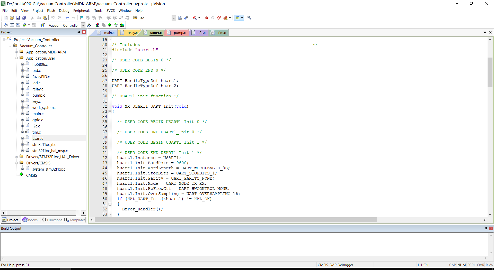
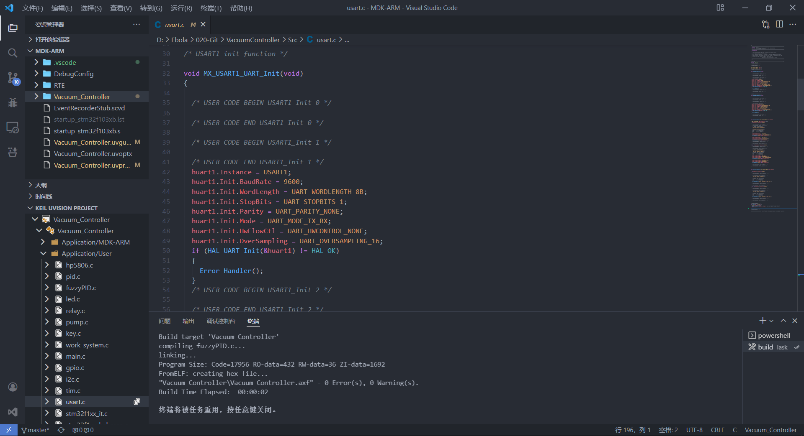

Keil5 虽比 Keil4 在界面上已经提升了许多，但是依旧缺发许多重要的功能（如代码补齐与代码高亮等）。而 VS Code 作为一个依靠插件便可以不断发展壮大的工具，也同样可以使用 **Keil Assistant** 插件来替换掉 Keil5 的代码编辑功能。

## 效果展示

下面将分别给出同一份文件在 Keil5 和 VS Code 中的效果对比。

可以很明显地对比出，VS Code 的使用在界面的美观上提升多大，同时 VS Code 在编辑代码时，许多提示类的工具也能有助于我们提升效率。

同时 **Keil Assistant** 插件也可以直接在 VS Code 上进行 **编译** 和 **下载** ，具体的 **功能特性** 如下：
- 加载 Keil C51/ARM 项目，并以 Keil 项目资源管理器的展示方式显示项目视图
- 自动监视 keil 项目文件的变化，及时更新项目视图
- 通过调用 Keil 命令行接口实现 编译，重新编译，烧录 keil 项目
- 自动生成 c_cpp_properties.json 文件，使 C/C++ 插件的语法分析能正常进行

:::tip

上图所示的 VS Code 使用了 One Dark Pro 主题，文件图标使用了 VSCode Icons Mac，图标主题使用了 EI-Minimalist Icons，需要可以自取。

:::

## 操作流程

### 准备工作
首先需要安装好 VS Code，Keil5，并处于 Windows 系统之下。网络中有一些 Blog 或教程贴还需要安装独立的编译器，此处其实不需要，因为 Keil Assistant 调用的是 Keil5 自带的 ARM Compiler。

随后在 VS Code 的拓展中搜索 `Keil Assistant` 安装插件。为了保证源文件能够正常显示和调用，还需要安装 `C/C++` 插件。

**划重点：**
- 安装插件 `Keil Assistant`
- 安装插件 `C/C++`
  
随后进入`Keil Assistant` 插件的设置界面，具体的方式就是点击插件旁边的小齿轮。在该界面，设置 Keil5 的绝对路径，后续编译下载需要调用。

### 开始使用

由于目前还不支持使用该插件直接在 VS Code 中创建工程并配置，所以在最初建立 STM32 工程的时候还是要使用到 Keil5。在完成了芯片选择，下载器方式，并配置好一些 Keil5 特有的功能后便可以进入下一步骤。

安装配置完毕后，在 VS Code 的侧边栏便多出来一个关于 Keil5 的下拉栏。点击如图所示位置便可以导入 Keil5 的工程文件，插件会自动对各个文件进行匹配连接。

### 常用操作

使用如下三个按钮便可以实现对程序的编译和下载，从左到右依次是**编译、下载、重新编译**，与 Keil5 中常用按键一致。

部分用户还可能同时开发多个工程，而下图的按键便可以在多个工程之间进行切换。其实个人觉得，也可以通过按 `Ctrl` + `Shift` + `N` 快捷键创建新的窗口来开启多个工程。

## 总结

虽然该插件没有办法让 VS Code 完美地替代 Keil5，诸如调试，创建工程和修改下载器等功能都没有办法实现，但是也已经提供了许多的便利之处。当前作者 **已经不更新** 了，但是源码已经开源，可以在 **[参考与致谢](#参考与致谢)** 中找到源码，有能力的用户可以自行增设更多的功能。

## 参考与致谢

- [VS Code编写Keil uVison 5工程](https://blog.csdn.net/weixin_43576926/article/details/107736692)
- [Keil Assistant GitHub](https://github.com/github0null/keil-assistant)
- [KEil5调用外部编辑器（VSCode）方法](https://blog.csdn.net/xiaowu___/article/details/103308890)

> 文章作者：**TwelveCat**  
> 原文地址：<https://wiki.twelvecat.com>  
> 版权声明：文章采用 [CC BY-NC-SA 4.0](https://creativecommons.org/licenses/by/4.0/deed.zh) 协议，转载请注明出处。