:::caution
这是一篇旧文，文章可能存在与 **[个人文档写作规范](./个人文档写作规范.md)** 相矛盾的地方。
:::

## 第一章 图像滤波背景
### 1.1 为什么图像可以滤波

通过对数字信号原理的学习，我们了解到针对一维函数，可以通过各种方法进行处理，通常分为时域与频域的处理。滤波即是从频域角度对信号进行处理，提取出有效信号，去除无效信号，从而方便我们对信号进行针对性的分析。

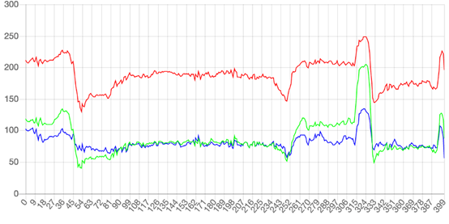

图1.1 彩色图像 RGB 示意图

图像实际上也是一种信号，但其能滤波的原因是由于图像本身就是各通道波函数的叠加结果。如图1.1 为衣服彩色图像分析其 RGB 通道后的示意图，从图中可以很好地印证这一观点。图中三种颜色的波函数在不同数值上进行波动，示意图中涵盖了 400 个像素点的信息。令 RGB 取均值处理即可获得图像的灰度图，灰度图的信号从原始的 RGB 三通道降低为亮度信号单通道，图像本身也显示为灰色<a href="#note1">[1]</a>。

对图像滤波即是针对颜色信号进行滤波处理，图中表示每条曲线都在不停的上下波动。有些区域的波动比较小，有些区域突然出现了大幅波动（参考图中 54 和 324 ）。其原图像为图1.2 所示，对比原图像可发现，曲线波动较大的地方正是图像出现突变的地方。这说明波动与图像是紧密关联的。图像本质上就是各种色彩波的叠加。

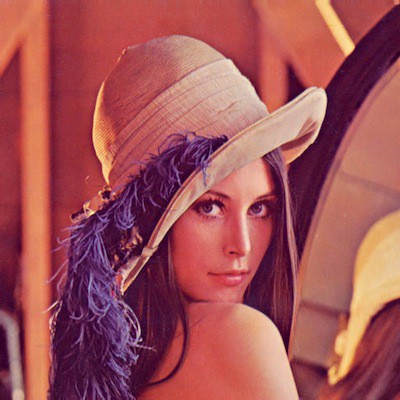

图1.2 彩色图像示意图

### 1.2 滤波的结果

了解到图像与波动的关系，我们就可以分析，对图像各通道的色彩波进行滤波处理后会产生什么样的影响。结合一维信号处理，当我们让信号通过低通滤波器后，会滤去其高频信号，信号保留住大概形状，移除了细节信号，如图1.3 所示，绿线为通过低通滤波器后的信号。

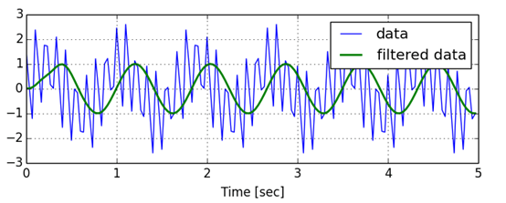

图1.3 低通滤波器示意图

相反，若将信号通过高通滤波器，即可滤去其原有形状，但保留住细节信号，如图1.4 所示，蓝线为过滤后的示意信号。

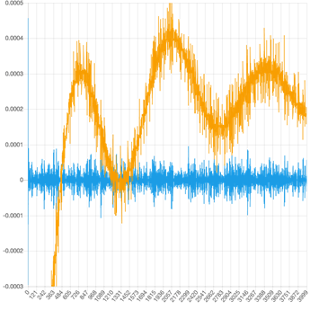

图1.4 高通滤波器示意图

将此原理推广到图像滤波中，可理解当图像经过低通滤波器后图像能够看清大概内容，但是图像本身的细节丢失，会变得模糊不清，若通过高通滤波器时，图像的主体内容丢失，但保留住了细节，即图像边缘突变信号被保留，常用于边缘提取，如图1.5 为图像经过滤波器的示意图，左图为通过低通滤波器，右图为通过高通滤波器。  

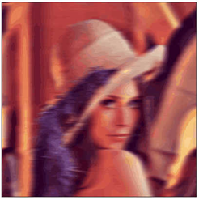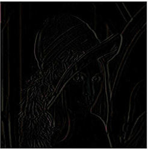

图1.5 经过滤波器后的图像

## 第二章 图像滤波原理

### 2.1 均值滤波

均值滤波（Normalized Box Filter）：用其像素点周围像素的平均值代替元像素值，在滤除噪声的同时也会滤掉图像的边缘信息。我们使用如下公式来表达均值滤波：
$$
O(i,j)=∑_{m,n}{I(i+m,j+n) ⋅k(m,n)}
$$
其中 K 为滤波器，在很多文献中也称之为核(Kernel)；(I, j) 是像素在图片中的位置；(m, n) 是卷积核中的位置/坐标，其中心点的坐标是 (0,0)；k(m, n) 是卷积核中在 (m, n) 上的权重参数；I(i+m, j+n) 是与 k(m, n) 相对应的图片像素值；O(i, j) 是图片中 (i, j) 像素的滤波/卷积结果。

针对均值滤波，我们令其核为矩形模板，可根据实际情况及其滤波结果确定合适的模板大小及模板权重系数，可采用如下公式进行计算：
$$
g(x, y)=\frac{1}{M} \sum_{f \in s} f(x, y)
$$
此处采取的均值滤波模板为 3*3 大小的模板，权重值均为 1，即上式中 M=9,模板如下所示：
$$
f=\frac{1}{9}\left[\begin{array}{lll}
1 & 1 & 1 \\
1 & 1 & 1 \\
1 & 1 & 1
\end{array}\right]
$$
在运算时，我们将此模板与图片信号做卷积，卷积结果映射为新的图片信号，即可完成滤波操作，卷积方式可参考图2.1 所示<a href="#note2">[2]</a>。

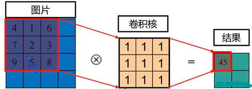

图2.1 图像卷积示意图

### 2.2 加权均值滤波

加权均值滤波公式与均值滤波相同，唯一不同在于其模板的选择上。加权均值滤波在所选模板的各个位置处权重值有所不同，可依据实际情况进行修改与调试，此方案与传统均值滤波有所不同的是他能对图片的像素点进行权重判断，可以侧重性的考虑个像素点的效果，从而产生不同的滤波效果，如图2.2 所示即为使用了加权均值模板进行卷积核运算<a href="#note2">[2]</a>。

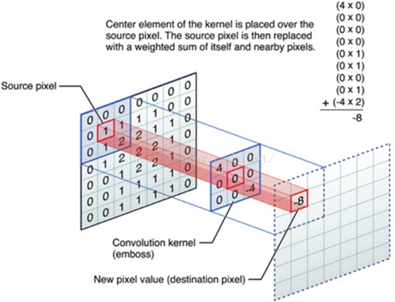

图2.2 加权模板卷积示意图

在加权均值滤波中，我们常使用高斯模板进行处理，高斯滤波器是一类根据高斯函数的形状来选择权值的线性平滑滤波器。高斯平滑滤波器对于抑制服从正态分布的噪声非常有效<a href="#note3">[3]</a>。
$$
f(x, y)=\frac{1}{2 \pi \sigma^{2}} e^{-\frac{x^{2}+y^{2}}{2 \sigma^{2}}}
$$
上式为高斯滤波器函数，另时，可计算出 3*3 的矩阵模板为（取整后）：
$$
\left[\begin{array}{lll}
1 & 2 & 1 \\
2 & 4 & 2 \\
1 & 2 & 1
\end{array}\right]
$$
结合均值滤波公式可令其模板为：
$$
f=\frac{1}{16}\left[\begin{array}{lll}
1 & 2 & 1 \\
2 & 4 & 2 \\
1 & 2 & 1
\end{array}\right]
$$

### 2.3 中值滤波

中值即是指一维奇数列经过排序后位于最中心的数值，中值滤波即将模板所提取出的数据进行排序后取除中值替代图片当前像素点的值，其运算形式如图2.3 所示。

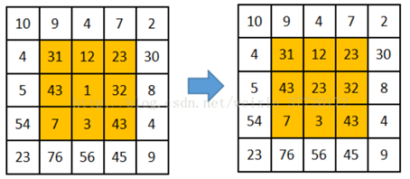

图2.3 中值滤波运算示意图

虽然中值滤波算法十分简单，但是其对椒盐噪声具有良好的消除特性，不过其缺点也十分明显，在滤波的同时会使得图片边缘细节丢失，整体显示较为模糊，使得图片有一种「涂抹感」。

### 2.4 AFMF滤波

AFMA滤波<a href="#note4">[4]</a>是基于中值滤波的缺点所提出，其全称为自适应模糊中值滤波。滤波过程分为噪声检测和噪声去除 2 个阶段。噪声检测阶段：采用极值法检测噪声，将图像的像素点分为两类，即疑似噪声点和信号点。通过疑似像素点和与其相邻的已处理的像素点的平均绝对灰度差值定义模糊隶属度函数，利用该函数对疑似噪声点是否为噪声进行模糊分类。噪声去除阶段：信号点保持原值输出，对于疑似噪声点的 3 种分类结果，采用模糊加权的中值滤波器进行统一处理。实验结果表明，较于多种传统滤波方法，该算法能更有效地去除椒盐噪声，保护图像细节。

针对椒盐噪声进行分析，可以发现其像素点值主要为 0 或 255，故可将图片信号中像素值为 0 或 255 的像素列为疑似噪声像素，针对非疑似噪声像素，后续将不再进行滤波处理，保留原值，即可以最大限度的保护图像细节，同时减少代码运算所需的时间开销。针对疑似噪声点，再根据其领域信号进一步分类为误判，确定及收噪声轻度影响到信号，对其进行不同的处理，以达到优秀的滤波效果。下式即表示疑似信号点的标记：
$$
N(i, j)=\left\{\begin{array}{c}
1, x(i, j)=L_{\text {salt}} \text {or } L_{\text {pepper}} \\
0, \text { otherwise }
\end{array}\right.
$$
其中 N(i, j) 表示其图像中疑似噪声点的坐标信息，$L_{salt}$ 或 $L_{pepper}$ 表示像素点值为 0 或 255，利用此方案进行初步标记。

针对疑似噪声点的二次判断，我们可以利用该点的像素值与领域像素值的最大绝对差值进行推测，但此方案会带来新的问题，即当一个疑似像素点领域内存在另一个疑似像素点可能使得其最大绝对差值为 255，从而误判其为噪声点，做出错误的滤波处理。为解决此问题，我们依旧采取 3*3 矩阵模板进行举例， 我们可以将当前所处理的疑似噪声点与其左上角  个已经处理完毕的信号求其最大绝对差值进行判断，因为左上角 4 个已经处理完毕的信号均可确定为有效信号，即可解决误判问题，此处将改四个像素设为 S 集合。

将其最大差值设为模糊变量 D(i, j),并将模糊变量进行线性拟合，设上下限值为 T1、T2,可利用一下公式进行判断模糊隶属函数的计算：
$$
F(i, j)=\left\{\begin{array}{c}
0, D(i, j) \leq T 1 \\
\frac{D(i, j)-T 1}{T 2-T 1}, T 1<D(i, j)<T 2 \\
1, D(i, j) \geq T 2
\end{array}\right.
$$
当 D(i, j) 大于 T2 时，即可确定其为噪声点，需要进行完全中值滤波，当其小于 T1 时，即可确定该点为误判信号，无需进行中值滤波，当其位于 T1 与 T2 之间，可利用加权运算的方式，将其中值与原信号进行综合运算，可归纳为如下公式，其中 M(i,j)为矩形模板中的中值。
$$
y(i,j)=(1-F(i,j))*x(i,j)+F(i,j)*M(i,j)
$$

## 第三章 软件实现方式

### 3.1 均值与加权均值滤波

本程序使用 Matlab 平台进行实验，对于均值滤波与加权均值滤波可采用同一方式进行，只需修改核函数的模板权重值即可。下面将给出两种方式的统一形式流程图。

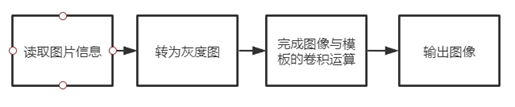

图3.1 均值滤波流程图

### 3.2 中值滤波

中值滤波与均值滤波在处理上有相似之处，有所不同的是我们不需要将模板与图像本体做卷积运算，而是将模板中的值取出后提取中值替代原坐标值，如图3.2 所示即为其软件设计流程图。

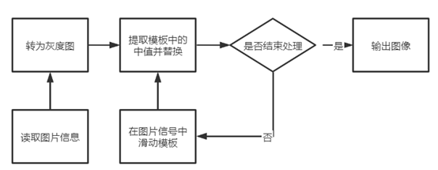

图3.2 中值滤波流程图

### 3.3 AFMF滤波

AFMF 滤波是基于中值滤波改进后的算法，其针对椒盐噪声提出了分类处理方案。对于非椒盐噪声部分完全保留原始信号，对于椒盐噪声或者疑似椒盐噪声部分再进行特殊处理，使得程序整体运行速度增快，同时针对图片的细节保留得更完全，也能达到相对较好的滤波效果。如图3.3 为 AFMF 滤波流程示意图。

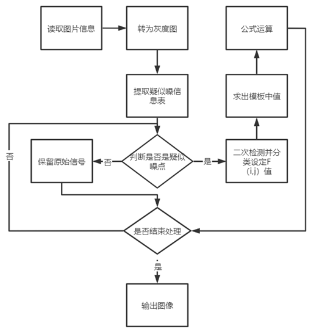

图3.3 AFMF 滤波流程图

## 第四章 实验结果与分析

结合以上原理与代码实现方式的理解，通过 Matlab 平台进行的图片测试，本次测试主要需要完成对椒盐噪声的去除，如图4.1 为所需处理的图片，在本次报告中，尝试了几种方案进行滤波处理与对比，下面将给出实验结果。

图4.1 带椒盐噪声的待处理图

### 4.1 均值滤波与加权均值滤波

如图4.2 为均值滤波与加权均值滤波等方案处理的结果对比图。

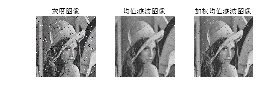

图4.2 均值处理结果图

从图中可以发现经过均值滤波后，椒盐噪声有一定程度的滤除，但由于均值滤波的处理原理，噪声更像是被「涂抹」而变得不是很显眼与尖锐。但图像整体也变得十分模糊，当使用加权均值滤波后图像的清晰度得到一定程度的环节，但是其噪声的滤除效果并不佳，由此可见此方案并不适合滤除椒盐噪声。

### 4.2 中值滤波

如图4.3 为不同窗口下的中值滤波方案处理的结果对比图。

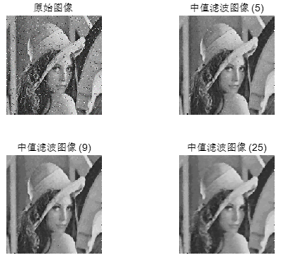

图4.3 中值处理结果图

此图中括号内的数字代表其模板窗口所含的像素点数量，其中 5 表示十字形滑动窗口， 9 表示 3\*3 模板窗口，25 表示 5\*5 模板窗口。在此背景下，我们可以从图中观察到，模板窗口所含的像素点数量越多，滤波效果越好，但是图像越模糊，细节丢失越严重。而当像素点数量越少时，滤波效果欠佳，但细节保留较好，由此可见，中值滤波具有较好的滤去椒盐噪声的能力，但考虑到模板窗口像素点越多图片越模糊，使用过程中需要充分考虑图片的损失与对噪声滤除效果的需求。

### 4.3 AFMF滤波

基于中值滤波的缺点，此处复现了 AFMF 滤波算法，在滤除较多噪声的情况下，尽可能保留图像细节，对比图如下图4.4 所示。

图4.4 AFMF 处理结果图

从图中可以进一步观察，AFMF 滤波算法在图片细节的保留上效果最佳，甚至超过五个像素点窗口的中值滤波，可从帽檐、头发丝、面部细节与背景等进行充分比较，其能够最大限度的保留原图的细节部分，而在椒盐滤波部分，其也能做到较大滤除。由于该算法是进行复现，在参数整定上未调制最佳，使得椒盐噪声的屡出效果没有发挥到最佳，但由此对比图亦可得出AFMF滤波算法的优异性。

## 第五章 个人总结

虽然之前接触到一些一维信号的滤波处理，但是对于图像滤波算是第一次接触，最初想尝试复合滤波方案，但是在尝试了几种方案后发现各种方案优缺点明显，很难互补，尤其是在对图片细节上难以保留。使得图像清晰度下降与细节丢失实际上是图像滤波中损失很大的方案，所以就想尝试其他的一些方案保留清晰度。

通过对相关文献的查询，发现了众多针对椒盐噪声的处理方案，其中不乏有使用智能算法，机器学习等方案进行处理，受限与近期任务较多时间较紧的情况下，没法对这些方案进行逐一复现对比，此处选取了实现上较为简便的 AFMF 滤波算法（自适应模糊中值滤波）。在此方案的复现中，发现一些问题，实际上椒盐噪声并非完全是 0 或 255，通过对图片的像素点数值观察，发现更多的椒盐信号可能是 10+ 甚至 20+，也有 220+ 等情况出现，之所以能够在图像中直观的感觉到其明显的黑白突变是由于其与周围信号存在较大的对比度。

结合此现象，针对性的修改了疑似噪点判断条件，同时又存在 T1 与 T2 参数的整定，在多次实验中发现，上述参数选取不同值时，滤波效果有不同的体现，故应当存在至少一个最佳参数组合，使得滤波效果达到最佳，能够比现存给出的对比图更优秀。

当然在解决此问题的过程中，也想到了很多可行的算法组合，例如最大值滤波器先滤去胡椒噪声再经过谐波均值滤波器滤去盐粒噪声，完成整个椒盐噪声的滤除，此方案可在以后的学习中进行尝试。

总的来说，这一次图像滤波还是可以学到一些东西，一定程度拓展了思维方式，结合手里正在学习的图像增强项目，想在以后的学习中收获更多的经验。

## 参考与致谢

- [[1] 阮一峰.图像与滤波](http://www.ruanyifeng.com/blog/2017/12/image-and-wave-filters.html) 
- [[2] 浮沉沉浮.图像滤波](https://www.cnblogs.com/fcfc940503/p/11298250.html,2019-08-04) 
- [[3] 图像滤波之高斯滤波介绍](https://www.cnblogs.com/qiqibaby/p/5289977.html) 
- [[4] 万丰丰,周国民,周晓.一种去除椒盐噪声的自适应模糊中值滤波算法[J].浙江大学学报(理学版),2019,46(04):445-453.](http://www.ruanyifeng.com/blog/2017/12/image-and-wave-filters.html) 
- [[5] 郭慧娟,白文江,岳云霄,林菲,白雪飞.去除图像椒盐噪声的自适应迭代均值滤波算法[J].太原学院学报(自然科学版),2020,38(03):23-28.](http://www.ruanyifeng.com/blog/2017/12/image-and-wave-filters.html) 

> 文章作者：**TwelveCat**  
> 原文地址：<https://wiki.twelvecat.com>  
> 版权声明：文章采用 [CC BY-NC-SA 4.0](https://creativecommons.org/licenses/by-nc-sa/4.0/deed.zh) 协议，转载请注明出处。